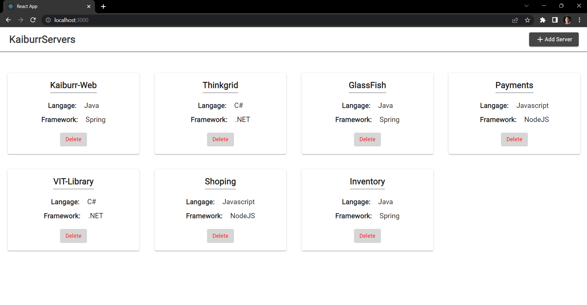
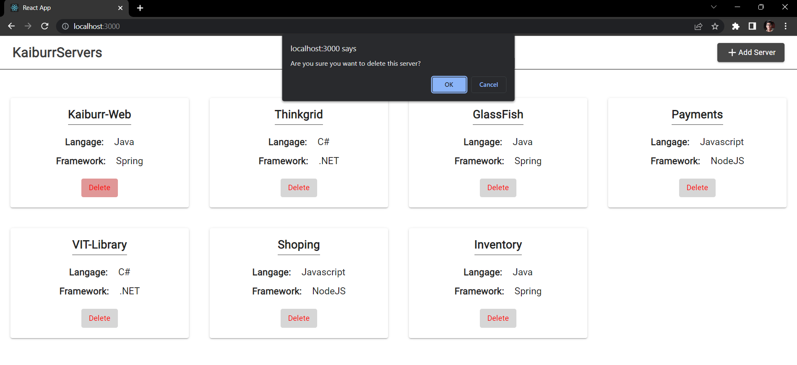
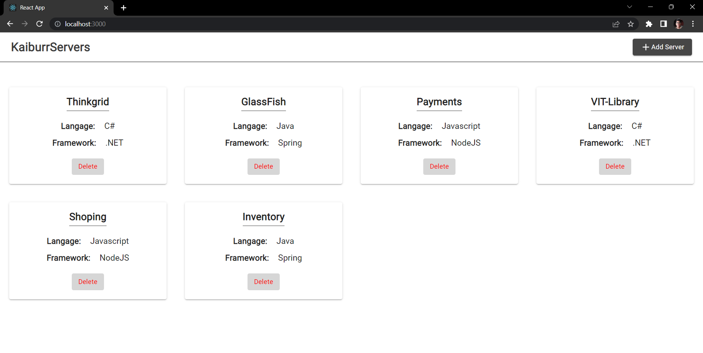
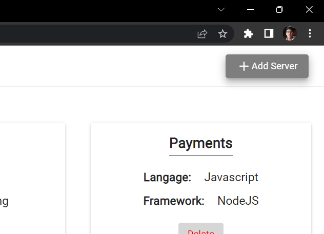
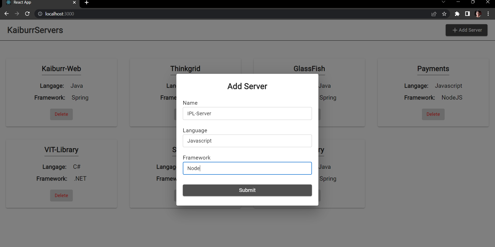
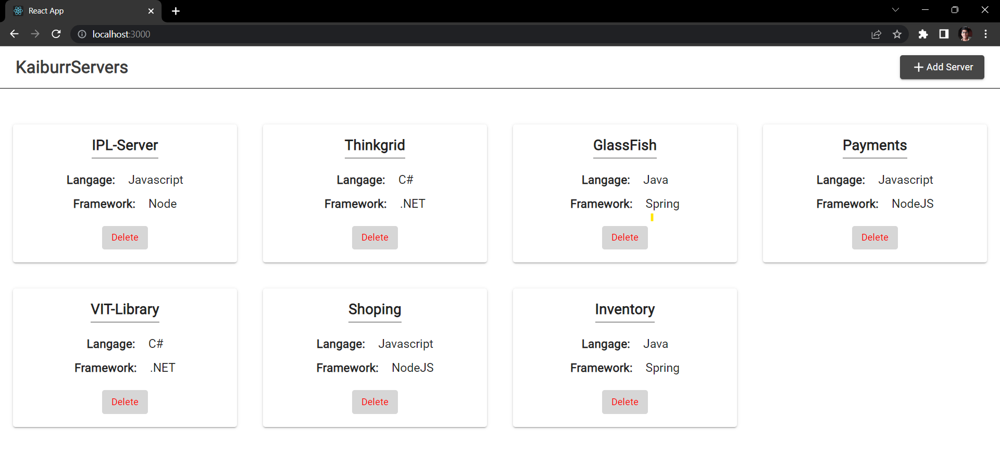

# Task-4-Kaiburr-Assessment
#### The purpose of this repository is to provide a solution to Task 4 from the Kaiburr's Assessment. Submitted by Dev Bilaspure.

### Task Description
The task is to create a basic web UI frontend for an application created in task #1 or #2 using any UI framework. The UI should allow the user to create, show, and delete records.

### Project Description
This project combines a Java Spring Boot REST API created in `task #1` with a React web UI.
The app allow the user to create, show, and delete documents of Server collection. Below are the screenshots of these features in action.

## Screenshots
#### 1. Show All Servers Documents

#### 2. Delete a Server Document

#### 3. Add a new Server Document

## Setup and run:

#### Step 1: Spin the Spring Boot Application created in Task 1(`https://github.com/Dev-Bilaspure/Kaiburr-Assessment-Task-1`)
#### Step 2: Clone this repository to your local machine
#### Step 3: Install dependencies with `npm install`
#### Step 4: Start the development server with `npm run start`
#### Step 5: Open your browser to `http://localhost:3000`

## Dependencies used
-Axios
-Material UI
-React
